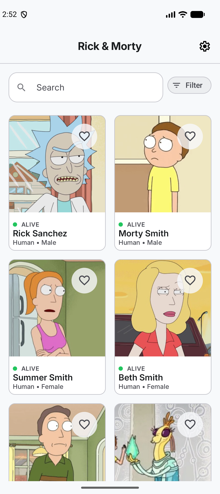
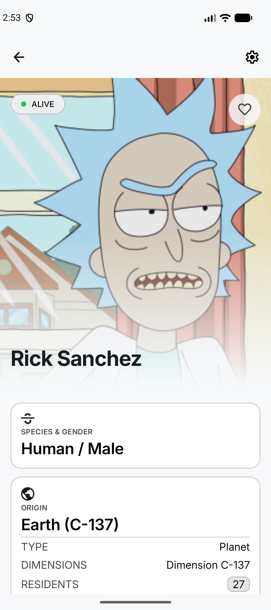
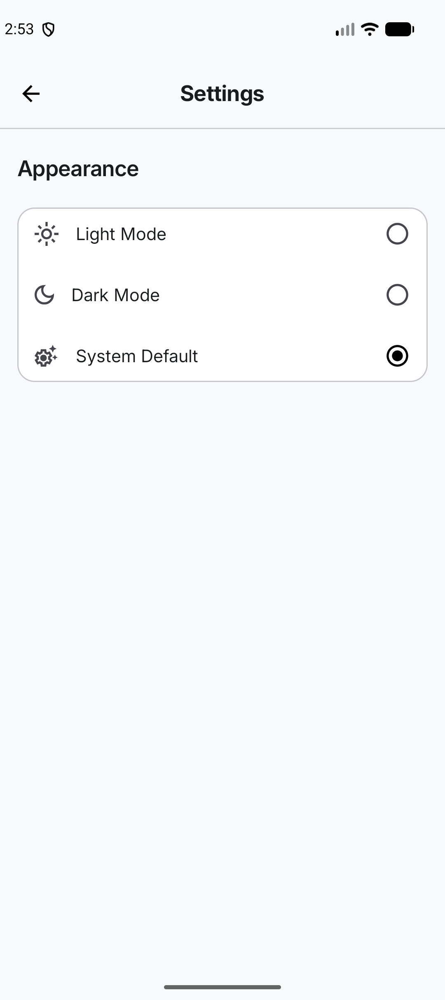
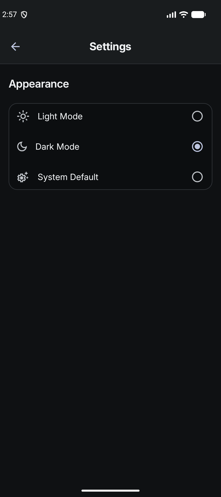

# Rick and Morty Sample App

**Rick and Morty Sample App for Napptilus**

Sample master/detail Android application that consumes the [Rick and Morty API](https://rickandmortyapi.com/) to display a paginated list of characters and a detailed character profile.

The application has been built with Clean Architecture principles, the Repository pattern and MVVM, with a clear separation between presentation, domain, data and framework concerns. The UI is implemented entirely with Jetpack Compose and Hilt is used for dependency injection.

## Features

- Browse Rick and Morty characters in a paginated grid.
- Cache the main character list locally with Room and Paging 3 Remote Mediator.
- Search characters by name.
- Filter characters by species, gender and status.
- Pull to refresh the character list.
- Open a character detail screen with image, status, species, gender, origin, last known location and episode appearances.
- Load additional location and episode information for character details.
- Mark and unmark characters as favourites with local persistence.
- Choose light, dark or system theme from the settings screen.
- Handle loading, empty, connectivity, server and unknown error states.
- Support offline-first character details when cached data is available.

## Architecture

The project follows a layered Clean Architecture approach. The domain layer contains business rules and repository contracts, the data layer coordinates data sources and pagination, the framework layer integrates external technologies such as Retrofit and Room, and the presentation layer exposes the application features through Compose screens and ViewModels.

The project is organized into the following layers:

- **Presentation:** Compose screens, UI state models, ViewModels and navigation.
- **Domain:** Business models, repository contracts, use cases and application errors.
- **Data:** Repository implementations, data sources, Paging components and data mappers.
- **Framework:** Retrofit services, OkHttp configuration, Room database, DAOs and persistence mappers.

The main flow is:

```text
Compose UI -> ViewModel -> Use Case -> Repository -> Data Source
                                                   -> Retrofit / Room
```

The home screen reads the character list from Room through Paging 3. `CharacterRemoteMediator` synchronizes remote pages with the local database. Search and filters use a dedicated remote `PagingSource`. Character details first expose cached data when available and then refresh from the API.

## Cache Strategy

The main character list uses Room as its local source of truth and is synchronized with the API through Paging 3 and `CharacterRemoteMediator`.

Cached character data is considered fresh for **one hour**. During this period:

- The application displays the cached list without requesting the first page again.
- Pull-to-refresh reuses the cache while it is still fresh.
- Pagination can continue using the stored remote key and next page.
- Once the TTL expires, the next refresh requests page one from the API and replaces the cached list.

The cache timestamp is stored with the Paging remote key and is updated when the first page is successfully synchronized. Character details also use cached data when available. Additional location and episode information is cached independently after being loaded successfully.

Searches and filters use a remote `PagingSource`, so they request data from the API and do not use the main character list TTL directly.

Character images use a dedicated Coil `ImageLoader` with a 50 MB disk cache and a memory cache limited to 25% of the available memory cache size. The loader reuses the application's OkHttp client and is registered as a singleton.

## Navigation Flow

```text
Home -> Character Detail -> Settings
```

The Home screen opens a character detail route using the character ID. Both Home and Detail can open Settings, and each secondary screen can navigate back to the previous destination.

## Error Handling

The domain layer represents connectivity, server and unknown failures through `AppError`. Detail screens map these errors to user-facing messages while preserving cached character content when possible.

Paging errors on the Home screen are currently presented through a generic connectivity message. This keeps the list experience simple, but does not expose the original server error code to the user.

## Known Limitations

- Pull-to-refresh does not force a network request while the main character cache is still valid.
- Name searches are activated after entering at least three characters.
- Searches and filters use the remote API and require network connectivity.
- Location and episode details are available offline only after they have been cached.
- The Home screen uses a generic connectivity message for Paging errors.

## Configuration and Security

The API base URL is provided through `BuildConfig.API_URL` and defaults to:

```text
https://rickandmortyapi.com/api/
```

The application does not require API keys or other secrets. Local Android configuration is kept in `local.properties`, which is excluded from version control.

## Screens

- **Home:** Character grid, search bar, filters, favourites and pull-to-refresh.
- **Detail:** Character header, status, favourite action, information cards, locations and episodes.
- **Settings:** Application appearance and theme selection.

## Screenshots

### Light Mode

| Home | Character Detail | Settings |
| :---: | :---: | :---: |
|  |  |  |

### Dark Mode

The application supports light, dark and system themes from the settings screen. Dark mode applies the same Material 3 palette across all screens.

| Home | Character Detail | Settings |
| :---: | :---: | :---: |
|  |  |  |

> Add the screenshots to `docs/screenshots/` using the following names: `home.png`, `detail.png`, `settings.png`, `home_dark.png`, `detail_dark.png` and `settings_dark.png`.

## Libraries Used

- **Kotlin:** Main programming language.
- **Jetpack Compose and Material 3:** Declarative UI toolkit and Material components.
- **AndroidX Navigation 3:** Type-safe navigation between application destinations.
- **ViewModel and Kotlin Flow:** Lifecycle-aware state management and reactive data streams.
- **Coroutines:** Asynchronous and non-blocking application work.
- **Hilt:** Dependency injection for Android components and application layers.
- **Paging 3:** Efficient pagination, local paging and remote synchronization.
- **Room:** Local SQLite abstraction used for character, location, episode and remote-key caching.
- **DataStore Preferences:** Persistence for the selected theme mode.
- **Retrofit and Kotlin Serialization:** Type-safe HTTP client and JSON serialization.
- **OkHttp:** HTTP client configuration and request logging.
- **Coil:** Asynchronous character image loading.
- **Timber:** Application logging.
- **JUnit:** Unit and instrumentation test framework.
- **MockK:** Mocking dependencies in unit tests.
- **Turbine:** Testing Kotlin Flow emissions.
- **MockWebServer:** Testing network and repository integrations.
- **Compose UI Test:** Instrumented tests for Compose screens and user interactions.

## Testing

The project includes:

- Unit tests for ViewModels, use cases, mappers and data-layer components.
- Room DAO instrumentation tests.
- Repository integration tests using MockWebServer.
- Compose UI tests for the settings and character detail screens.

## Requirements

- Android Studio with Android SDK 37.
- JDK 17.
- Android device or emulator running API 24 or higher.

## Build and Run

Open the project in Android Studio and run the `app` configuration on an emulator or connected device.

From the command line, use:

```bash
./gradlew assembleDebug
```

On Windows:

```powershell
.\gradlew.bat assembleDebug
```

## Run Tests

Run unit tests with:

```bash
./gradlew test
```

Run Android instrumentation tests with a connected device or emulator:

```bash
./gradlew connectedAndroidTest
```

On Windows, replace `./gradlew` with `.\gradlew.bat`.

## Code Style

The project uses [ktlint](https://github.com/ktlint/ktlint) through the `org.jlleitschuh.gradle.ktlint` Gradle plugin. Style rules are defined in the `.editorconfig` file, which follows the `android_studio` code style with a maximum line length of 120 characters and ignores the `function-naming` rule for `@Composable` functions.

Check code style with:

```bash
./gradlew ktlintCheck
```

Auto-format the codebase with:

```bash
./gradlew ktlintFormat
```

`ktlintCheck` runs as part of the `check` task. On Windows, replace `./gradlew` with `.\gradlew.bat`.

The repository includes a Git pre-commit hook (`.githooks/pre-commit`) that runs `ktlintFormat`, re-stages the formatted files and aborts the commit if `ktlintCheck` fails. Enable it with:

```bash
git config core.hooksPath .githooks
```

## Continuous Integration (CI)

The repository includes a GitHub Actions workflow (`.github/workflows/ci.yml`) that runs on every push to `master` and on every pull request targeting `master`. It can also be triggered manually from the Actions tab (`workflow_dispatch`).

The workflow runs the following jobs in parallel:

- **Unit tests:** runs `./gradlew :app:testDebugUnitTest` and publishes the JUnit results.
- **Build:** assembles the debug APK (`:app:assembleDebug`) and uploads it as an artifact.
- **Static analysis:** runs `./gradlew :app:ktlintCheck` to enforce the project code style.
- **Instrumented tests:** runs `connectedDebugAndroidTest` on Android emulators (API 24, 34 and 36) with a cached AVD snapshot. This covers Compose UI tests, Room DAO tests and repository integration tests.

A push while a run is in progress cancels the previous run (`concurrency` with `cancel-in-progress`).

## Project Structure

```text
app/
├── src/main/
│   ├── java/com/adrc95/rickyandmorty/
│   │   ├── data/
│   │   │   ├── datasource/       Remote, Room and DataStore data sources
│   │   │   ├── mapper/           Data-to-domain mappers
│   │   │   ├── paging/           RemoteMediator and search PagingSource
│   │   │   └── repository/       Repository implementations
│   │   │
│   │   ├── di/                   Hilt dependency-injection modules
│   │   │
│   │   ├── domain/
│   │   │   ├── exception/        Result and application errors
│   │   │   ├── model/            Business models
│   │   │   ├── repository/       Repository contracts
│   │   │   └── usecase/          Application business use cases
│   │   │
│   │   ├── framework/
│   │   │   ├── database/
│   │   │   │   ├── dao/          Room DAOs
│   │   │   │   ├── entity/       Room entities
│   │   │   │   └── mapper/       Entity-to-domain mappers
│   │   │   └── network/
│   │   │       ├── dto/          API response models
│   │   │       ├── mapper/       DTO-to-domain mappers
│   │   │       └── service/      Retrofit API services
│   │   │
│   │   └── presentation/
│   │       ├── core/             Shared UI components and display models
│   │       ├── detail/           Character detail screen and ViewModel
│   │       ├── filter/           Filter bottom sheet and filter models
│   │       ├── home/             Character list, search and filters
│   │       ├── navigation/       Navigation routes and root
│   │       ├── settings/         Theme settings screen and ViewModel
│   │       └── ui/theme/         Compose theme, colors and typography
│   │
│   └── res/                      Android resources
│
├── src/test/                     Unit, mapper and ViewModel tests
├── src/sharedTest/               Shared test builders and Paging utilities
└── src/androidTest/              Compose, Room DAO and integration tests
```

## API

Character, location and episode data are provided by the [Rick and Morty API](https://rickandmortyapi.com/). This project is a sample application created for demonstration and technical evaluation purposes.
