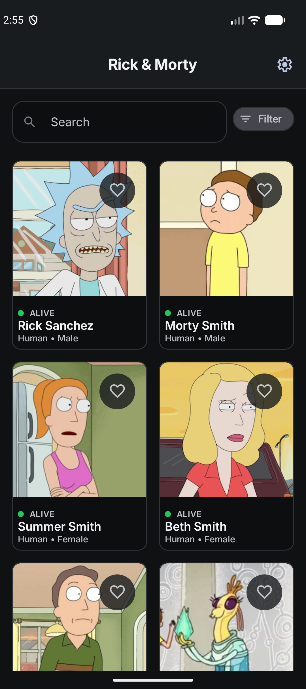
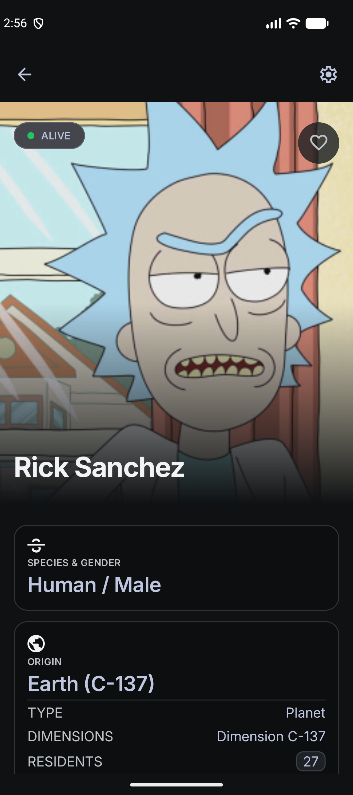
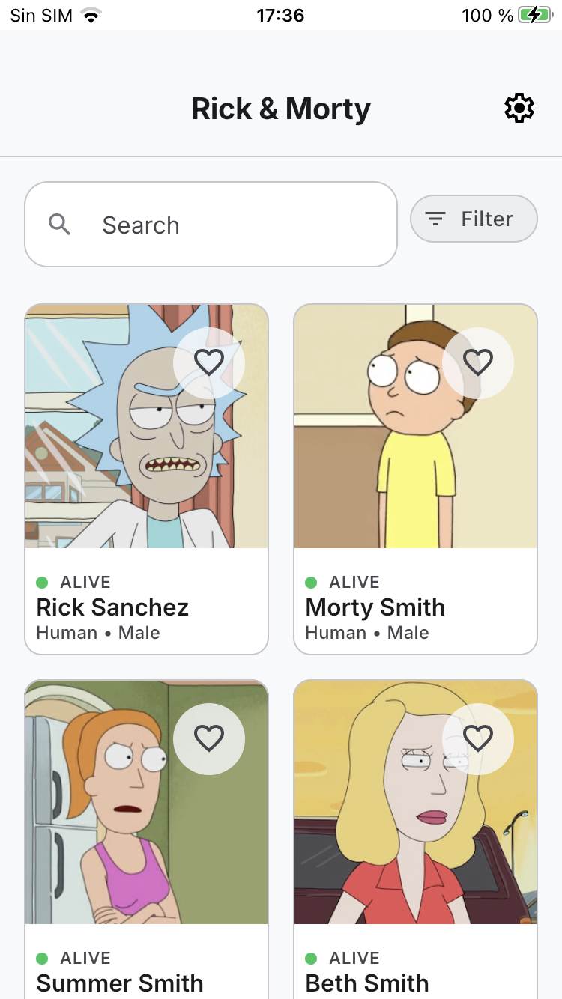
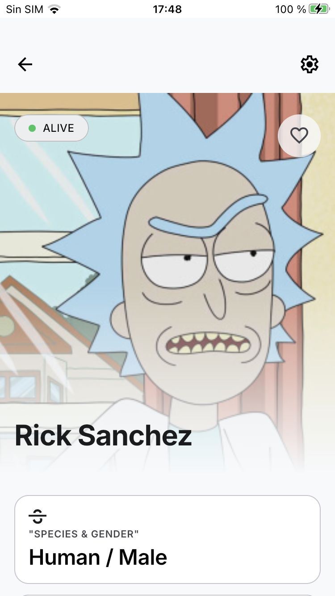
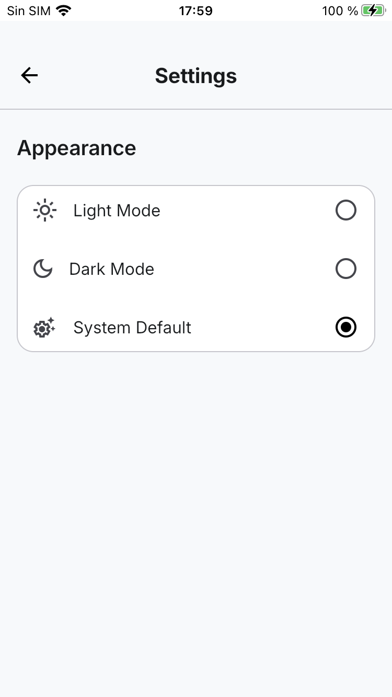
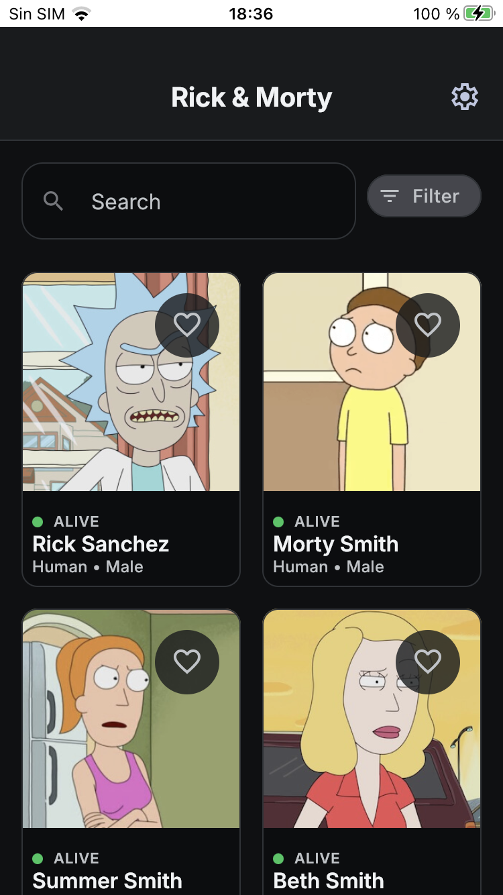
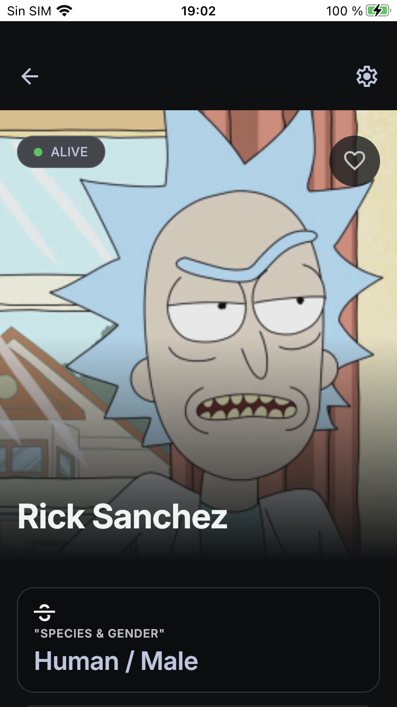
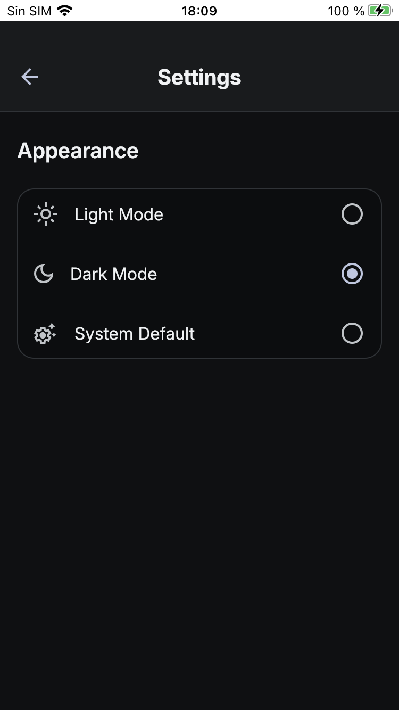

# Rick and Morty Sample App

**Rick and Morty Sample App**

Sample master/detail application built with **Kotlin Multiplatform** and **Compose Multiplatform** for Android and iOS. It consumes the [Rick and Morty API](https://rickandmortyapi.com/) to display a paginated list of characters and a detailed character profile.

The application follows Clean Architecture principles, the Repository pattern and MVVM, with a clear separation between presentation, domain, data and framework concerns. The UI is implemented entirely with Compose Multiplatform and shared across Android and iOS, and Koin Annotations is used for dependency injection.

## Features

- Browse Rick and Morty characters in a paginated grid.
- Cache the main character list locally with Room and Paging 3 Remote Mediator.
- Search characters by name.
- Filter characters by species, gender and status.
- Pull to refresh the character list.
- Open a character detail screen with image, status, species, gender, origin, last known location and episode appearances.
- Load additional location and episode information for character details.
- Mark and unmark characters as favourites with local persistence.
- Choose light, dark or system theme from the settings screen.
- Handle loading, empty, connectivity, server and unknown error states.
- Support offline-first character details when cached data is available.
- Run the same shared UI and business logic on Android and iOS.

## Architecture

The project follows a layered Clean Architecture approach and is organised as a Kotlin Multiplatform project. The `shared` module contains the application code used by both platforms, while `androidApp` and `iosApp` are thin platform entry points.

Inside `shared`, the `commonMain` source set holds the domain, data and presentation layers together with the common framework code. Platform-specific integrations live in `androidMain` and `iosMain` through `expect`/`actual` declarations.

The project is organized into the following layers:

- **Presentation:** Compose Multiplatform screens, UI state models, ViewModels and navigation.
- **Domain:** Business models, repository contracts, use cases and application errors.
- **Data:** Repository implementations, data sources, Paging components and data mappers.
- **Framework:** Ktor client, Ktorfit services, Room database, DAOs, DataStore preferences and cache storages.

The main flow is:

```text
Compose UI -> ViewModel -> Use Case -> Repository -> Data Source
                                                   -> Ktor / Room
```

The home screen reads the character list from Room through Paging 3. `CharacterRemoteMediator` synchronizes remote pages with the local database. Search and filters use a dedicated remote `PagingSource`. Character details first expose cached data when available and then refresh from the API.

Platform-specific behaviour is provided through `expect`/`actual` declarations:

- Database construction (`AppDatabase`): Android requires a `Context`, iOS uses the default driver.
- DataStore file location: Android uses `filesDir`, iOS uses the documents directory.
- System dark theme detection and status bar configuration.
- Cache directories and the shared Coil `ImageLoader`.
- HTTP engine: OkHttp on Android and Darwin on iOS.

## Cache Strategy

The main character list uses Room as its local source of truth and is synchronized with the API through Paging 3 and `CharacterRemoteMediator`.

Cached character data is considered fresh for **one hour**. During this period:

- The application displays the cached list without requesting the first page again.
- Pull-to-refresh reuses the cache while it is still fresh.
- Pagination can continue using the stored remote key and next page.
- Once the TTL expires, the next refresh requests page one from the API and replaces the cached list.

The cache timestamp is stored with the Paging remote key and is updated when the first page is successfully synchronized. Character details also use cached data when available. Additional location and episode information is cached independently after being loaded successfully.

In addition to the Room cache, API responses are cached with the Ktor `HttpCache` plugin backed by a custom `OkioCacheStorage` (10 MB with LRU eviction), so repeated requests can be served from the HTTP cache even without network connectivity on both platforms.

Searches and filters use a remote `PagingSource`, so they request data from the API and do not use the main character list TTL directly.

Character images use a shared Coil 3 `ImageLoader` with a 50 MB disk cache and a memory cache limited to 25% of the available memory cache size. The loader reuses the shared Ktor `HttpClient` (`coil-network-ktor3`) and is provided by each platform's `NativeModule`.

## Navigation Flow

```text
Home -> Character Detail -> Settings
```

The Home screen opens a character detail route using the character ID. Both Home and Detail can open Settings, and each secondary screen can navigate back to the previous destination.

## Error Handling

The domain layer represents connectivity, server and unknown failures through `AppError`. Detail screens map these errors to user-facing messages while preserving cached character content when possible.

The shared Ktor `HttpClient` uses `expectSuccess = true` so that non-successful responses are converted into the same application errors as before.

Paging errors on the Home screen are currently presented through a generic connectivity message. This keeps the list experience simple, but does not expose the original server error code to the user.

## Known Limitations

- Pull-to-refresh does not force a network request while the main character cache is still valid.
- Name searches are activated after entering at least three characters.
- Searches and filters use the remote API and require network connectivity.
- Location and episode details are available offline only after they have been cached.
- The Home screen uses a generic connectivity message for Paging errors.

## Configuration and Security

The API base URL is provided through `BuildConfig.API_URL`, generated by the `buildconfig` Gradle plugin in the `shared` module, and defaults to:

```text
https://rickandmortyapi.com/api/
```

The application does not require API keys or other secrets. The iOS team identifier is passed to Xcode at build time and is not committed. Local Android configuration is kept in `local.properties`, which is excluded from version control.

## Screens

- **Home:** Character grid, search bar, filters, favourites and pull-to-refresh.
- **Detail:** Character header, status, favourite action, information cards, locations and episodes.
- **Settings:** Application appearance and theme selection.

## Screenshots

### Android

#### Light Mode

| Home | Character Detail | Settings |
| :---: | :---: | :---: |
|  |  |  |

#### Dark Mode

| Home | Character Detail | Settings |
| :---: | :---: | :---: |
|  |  |  |

### iOS (iPhone 7)

#### Light Mode

| Home | Character Detail | Settings |
| :---: | :---: | :---: |
|  |  |  |

#### Dark Mode

| Home | Character Detail | Settings |
| :---: | :---: | :---: |
|  |  |  |

## Libraries Used

- **Kotlin:** Main programming language (2.4.10).
- **Kotlin Multiplatform:** Shared business logic and UI across Android and iOS.
- **Compose Multiplatform and Material 3:** Declarative UI toolkit and Material components shared across platforms.
- **Navigation 3 (JetBrains):** Type-safe navigation between application destinations.
- **ViewModel and Kotlin Flow:** Lifecycle-aware state management and reactive data streams.
- **Coroutines:** Asynchronous and non-blocking application work.
- **Koin:** Dependency injection for Android, iOS and shared components, configured with Koin Annotations and KSP.
- **Paging 3:** Efficient pagination, local paging and remote synchronization.
- **Room (KMP):** Local SQLite abstraction used for character, location, episode and remote-key caching, with the bundled SQLite driver.
- **DataStore Preferences (KMP):** Persistence for the selected theme mode.
- **Ktor:** Cross-platform HTTP client with content negotiation, JSON serialization, logging and the `HttpCache` plugin.
- **Ktorfit:** Type-safe HTTP client built on top of Ktor and Kotlin Serialization (Retrofit-style API).
- **Kotlinx Serialization:** JSON serialization.
- **Okio:** File-system access used by the custom Ktor cache storage.
- **Coil 3:** Asynchronous character image loading with a Ktor network backend.
- **Napier:** Multiplatform application logging.
- **JUnit:** Unit and instrumentation test framework.
- **Mokkery:** Multiplatform mocking library used in unit tests.
- **Turbine:** Testing Kotlin Flow emissions.
- **MockWebServer:** Testing network and repository integrations.
- **Compose UI Test:** Shared tests for Compose screens and user interactions.

## Testing

The project includes:

- Shared unit tests for ViewModels, use cases, mappers and data-layer components (`commonTest`).
- Shared Compose UI tests for the home, character detail and settings screens (`commonTest`).
- Room DAO instrumentation tests, repository integration tests using MockWebServer and Compose UI tests on Android devices (`androidDeviceTest`).
- Kotlin/Native tests for the iOS targets.

## Requirements

- Android Studio with Android SDK 37.
- JDK 17.
- Android device or emulator running API 24 or higher.
- For iOS: macOS with Xcode and an iOS 15.6 or higher simulator or device.

## Build and Run

### Android

Open the project in Android Studio and run the `androidApp` configuration on an emulator or connected device.

From the command line, use:

```bash
./gradlew :androidApp:assembleDebug
```

On Windows:

```powershell
.\gradlew.bat :androidApp:assembleDebug
```

### iOS

Open `iosApp/iosApp.xcodeproj` in Xcode and run the `iosApp` scheme on a simulator or device. The Xcode project builds the shared framework through a Gradle build phase, so no manual framework step is required.

## Run Tests

Run the shared host tests with:

```bash
./gradlew :shared:testAndroidHostTest
```

Run Android instrumentation tests with a connected device or emulator:

```bash
./gradlew :shared:connectedAndroidDeviceTest
```

Run the iOS tests on a macOS host:

```bash
./gradlew :shared:iosSimulatorArm64Test
```

On Windows, replace `./gradlew` with `.\gradlew.bat`.

## Code Style

The project uses [ktlint](https://github.com/ktlint/ktlint) through the `org.jlleitschuh.gradle.ktlint` Gradle plugin on the `androidApp` module. Style rules are defined in the `.editorconfig` file, which follows the `android_studio` code style with a maximum line length of 120 characters and ignores the `function-naming` rule for `@Composable` functions.

Check code style with:

```bash
./gradlew :androidApp:ktlintCheck
```

Auto-format the codebase with:

```bash
./gradlew :androidApp:ktlintFormat
```

`ktlintCheck` runs as part of the `check` task. On Windows, replace `./gradlew` with `.\gradlew.bat`.

The repository includes a Git pre-commit hook (`.githooks/pre-commit`) that runs `ktlintFormat`, re-stages the formatted files and aborts the commit if `ktlintCheck` fails. Enable it with:

```bash
git config core.hooksPath .githooks
```

## Continuous Integration (CI)

The repository includes a GitHub Actions workflow (`.github/workflows/ci.yml`) that runs on every push and pull request targeting `compose-multiplatform`. It can also be triggered manually from the Actions tab (`workflow_dispatch`).

The workflow runs the following jobs:

- **Android unit tests:** runs `./gradlew :shared:testAndroidHostTest` and publishes the JUnit results.
- **Android build:** assembles the debug APK (`:androidApp:assembleDebug`) and uploads it as an artifact.
- **Static analysis:** runs `./gradlew :androidApp:ktlintCheck` to enforce the project code style.
- **Android instrumented tests:** runs `:shared:connectedAndroidDeviceTest` on Android emulators (API 24) with a cached AVD snapshot. This covers Compose UI tests, Room DAO tests and repository integration tests.
- **iOS:** runs on a macOS runner, builds the shared framework for the iOS targets and executes the Kotlin/Native tests with `./gradlew :shared:iosSimulatorArm64Test`.

A push while a run is in progress cancels the previous run (`concurrency` with `cancel-in-progress`).

## Project Structure

```text
androidApp/                     Android application entry point (MainActivity and Koin setup)
iosApp/                         iOS application entry point (Xcode project and SwiftUI wrapper)
shared/
└── src/
    ├── commonMain/
    │   ├── kotlin/com/adrc95/rickyandmorty/
    │   │   ├── data/           Repository implementations, paging and data sources
    │   │   ├── di/             Koin dependency-injection modules and annotations
    │   │   ├── domain/         Models, repository contracts, use cases and errors
    │   │   ├── framework/      Database, network, preferences, image and shared UI
    │   │   └── presentation/   Compose Multiplatform UI, ViewModels and navigation
    │   └── composeResources/   Shared drawables, fonts and strings
    ├── androidMain/            Android actuals (database, DataStore, status bar, theme, image)
    ├── iosMain/                iOS actuals and the MainViewController entry point
    ├── commonTest/             Shared unit tests and Compose UI tests
    └── androidDeviceTest/      Android DAO, integration and UI device tests
```

## API

Character, location and episode data are provided by the [Rick and Morty API](https://rickandmortyapi.com/). This project is a sample application created for demonstration and technical evaluation purposes.
